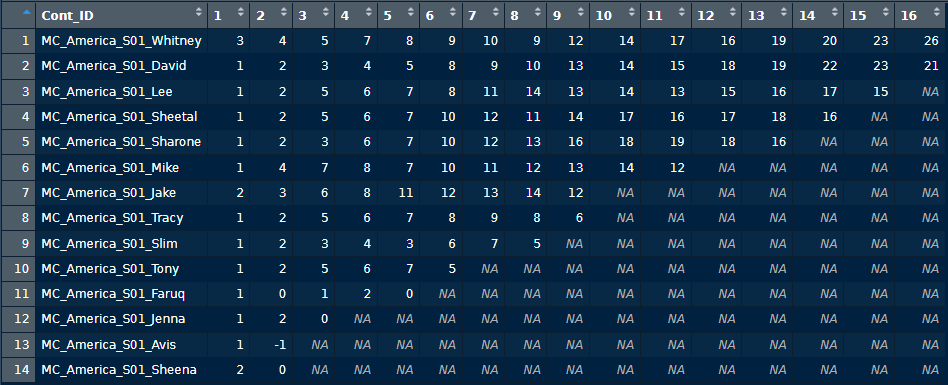
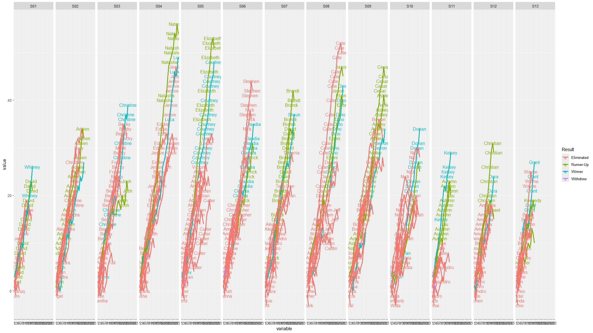

JG_Data_Science_Master_Chef

This project is a portfolio piece for my data science resume. I used RStudio to scrape data from wikipedia on the popular "Master Chef" show, hosted by Gordon Ramsay.

## Project Summary

Youtube video explaining the project:
https://www.youtube.com/watch?v=wKWZW08O-EY

In the "Master Chef" show, contestants compete in multiple rounds and are graded by the quality of their dishes. 

I used Rvest to bring the Wikipedia table into a dataframe in RStudio:

I converted these grades into numbers ranging from -2 for being eliminated, up to 3 for creating the best dish in that round. 

I then created a new table in RStudio to calculate the cumulative sums for each contestant over time. 

This gives us data that we can convert into a line graph.

Now we can see that in some seasons, sometimes people won despite not being as high in the graph as others.

Here is a point graph showing all contestants from seasons 1-13, colored by their final standing.

Type of project: Data analysis / visualization

Tools used: R, ggplot2, tidyverse, reshape2, rvest, tibble

Key skills demonstrated: Web scraping, function creation, data wrangling, data visualization